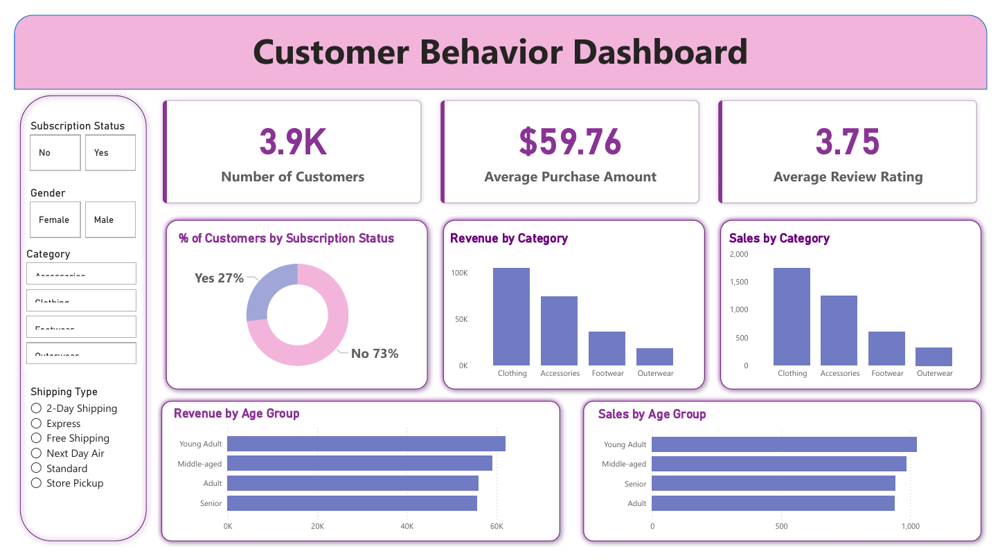

# 🛍️ Customer Shopping Behavior Analysis

An end-to-end **Data Analytics** project that analyzes customer shopping behavior using **Python, MySQL, SQL, and Power BI**.

## 🚀 Workflow

CSV Dataset → Python (Data Cleaning) → MySQL → SQL Analysis → Power BI Dashboard

## 🛠️ Tools Used

- Python
- Pandas
- MySQL
- SQL
- Power BI
- Jupyter Notebook

## 📊 Dashboard Preview

## 📌 Key Features

- Data Cleaning & Feature Engineering
- MySQL Database Integration
- SQL Business Analysis
- Interactive Power BI Dashboard
- Customer Segmentation
- Revenue & Sales Analysis

## ⭐ Skills

Python • MySQL • SQL • Power BI • Data Cleaning • Data Analysis • Data Visualization
